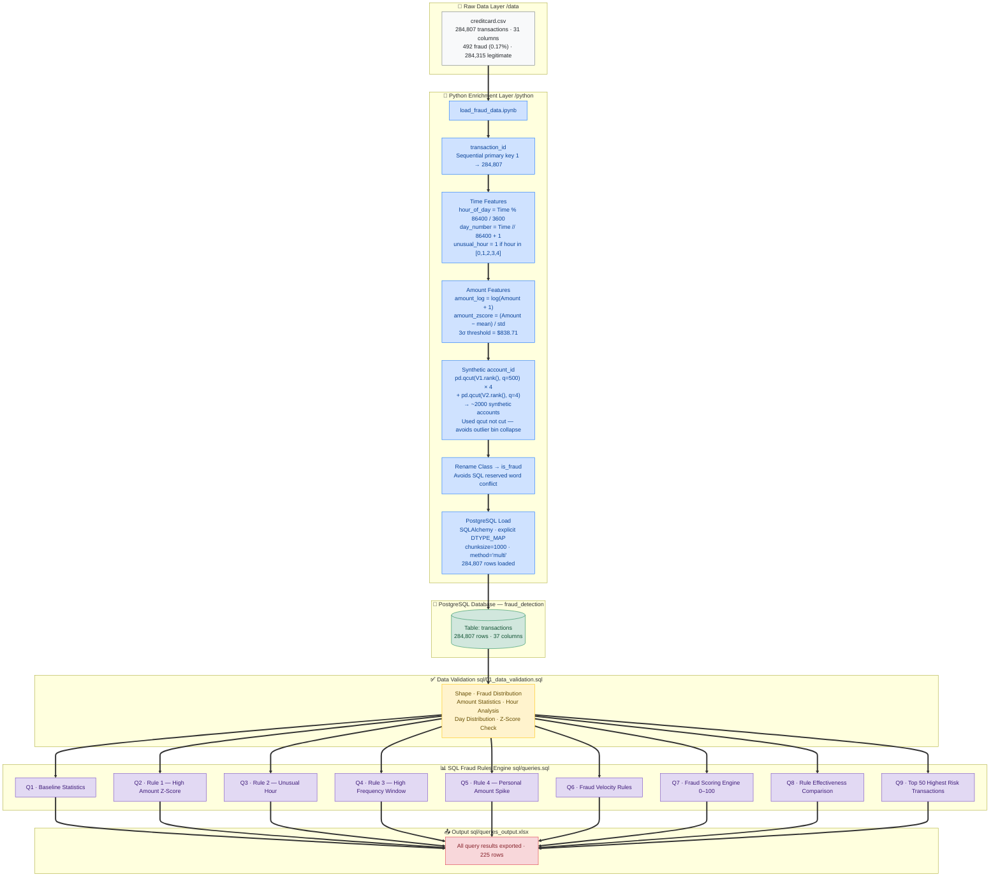

# Financial Transactions Fraud Detection — Credit Card Dataset (PostgreSQL)

## Overview

Rule-based fraud detection system built on 284,807 real anonymized credit card
transactions. Since the dataset had no account identifiers (removed for privacy),
a **Python enrichment pipeline** was built first to engineer synthetic account
groupings, time-based features, and statistical anomaly scores. The enriched
dataset was then loaded into PostgreSQL where 4 fraud detection rules were
implemented and combined into a weighted scoring engine that assigns every
transaction a risk score from 0 to 100.

A key advanced concept implemented here is **data leakage prevention** using
`ROWS BETWEEN UNBOUNDED PRECEDING AND 1 PRECEDING` in window functions —
ensuring each transaction is evaluated only against its own historical baseline,
not against data that includes itself.

---

## Data Flow Architecture



---

## Tech Stack

| Tool | Purpose |
|---|---|
| **Python 3** | Data enrichment + feature engineering |
| **Pandas** | CSV load, column engineering, qcut binning |
| **NumPy** | log1p transformation, z-score calculation |
| **SQLAlchemy + psycopg2** | PostgreSQL connection + explicit dtype DDL |
| **PostgreSQL** | All 9 fraud detection SQL queries |
| **pgAdmin** | SQL execution and result export |

---

## Dataset

| Detail | Info |
|---|---|
| Source | [Credit Card Fraud Detection — Kaggle](https://www.kaggle.com/datasets/mlg-ulb/creditcardfraud) |
| File | `creditcard.csv` |
| Total transactions | 284,807 |
| Fraud transactions | 492 (0.1727%) |
| Legitimate transactions | 284,315 (99.8273%) |
| Features | Time, V1–V28 (PCA anonymized), Amount, Class |
| Period covered | ~48 hours (2 days) |

### Data Validation Results

**Amount Statistics:**

| Metric | Value |
|---|---|
| Min Amount | $0.00 |
| Max Amount | $25,691.16 |
| Mean Amount | $88.35 |
| Median Amount | $22.00 |
| Std Dev | $250.12 |
| 3σ Threshold | $838.71 |
| 95th Percentile | $365.00 |
| 99th Percentile | $1,017.90 |

**Fraud by Day:**

| Day | Transactions | Fraud |
|---|---|---|
| Day 1 | 144,786 | 281 |
| Day 2 | 140,021 | 211 |

**Z-Score Pre-check:**

| Metric | Value |
|---|---|
| Transactions flagged by z-score > 3 | 4,076 |
| Actual fraud within those | 11 |
| Total fraud in dataset | 492 |

---

## Python Enrichment Details

### Key Engineering Decisions

**1. Synthetic account_id — why `pd.qcut` not `pd.cut`:**

```
pd.cut()  → equal-width bins → fails on V1 (extreme outliers collapse 95%
            of data into ~60 of the 500 bins → only 491 accounts created)

pd.qcut() → equal-frequency bins → each bin gets same number of rows
            → ~2000 evenly distributed accounts → proper frequency analysis
```

**2. Data Leakage Prevention in Window Functions:**

```sql
-- WRONG — includes current row (Case A)
AVG("Amount") OVER (PARTITION BY account_id ORDER BY transaction_id
                    ROWS BETWEEN UNBOUNDED PRECEDING AND CURRENT ROW)
-- A $10,000 fraud inflates its own baseline
-- Z-score drops to 1.50 → fraud goes undetected

-- CORRECT — excludes current row (Case B)
AVG("Amount") OVER (PARTITION BY account_id ORDER BY transaction_id
                    ROWS BETWEEN UNBOUNDED PRECEDING AND 1 PRECEDING)
-- Baseline = historical only
-- $10,000 against $20 avg → Z-score = 998,000 → immediately flagged
```

**3. Column renamed Class → is_fraud:**
`Class` is a reserved keyword in some SQL dialects and ambiguous.
`WHERE is_fraud = 1` is instantly readable; `WHERE Class = 1` is not.

---

## Business SQL Analysis — 9 Queries & Findings

---

### Query 1 — Baseline Fraud Statistics
**Concepts:** Conditional aggregation, AVG with CASE WHEN

| Metric | Value |
|---|---|
| Total transactions | 284,807 |
| Total fraud | 492 |
| Fraud rate | **0.1727%** |
| Avg fraud amount | **$122.21** |
| Avg legitimate amount | $88.29 |
| Max transaction | $25,691.16 |
| Unusual hour transactions | 20,944 |
| Fraud in unusual hours | **113 (23% of all fraud)** |

**Key insight:** Fraudulent transactions average $122.21 vs $88.29 for
legitimate — fraudsters transact at higher amounts. 113 of 492 fraud
cases (23%) occur in unusual hours despite unusual hours being only
7.4% of all transactions — a strong temporal signal.

---

### Query 2 — Rule 1: High Amount Z-Score Flag (> 3σ)
**Concepts:** CTE, CROSS JOIN for broadcasting stats, NULLIF

| Flag | Transactions | Fraud Caught | False Positives | Precision | Recall |
|---|---|---|---|---|---|
| FLAGGED — High Amount | 4,076 | **11** | 4,065 | 0.27% | 2.24% |
| Normal | 280,731 | 481 | 280,250 | 0.17% | 97.76% |

**Key insight:** Rule 1 catches only 11 of 492 fraud cases. Precision 0.27%
means 99.73% of flags are false positives. High amount alone is a weak
standalone predictor — most fraud blends into normal amount ranges. Valuable
only when combined with other rules in the scoring engine.

---

### Query 3 — Rule 2: Unusual Hour Flag (0–4am)
**Concepts:** CASE WHEN time bucketing, grouped fraud rate analysis

**Top fraud-rate hours:**

| Hour | Period | Transactions | Fraud | Fraud Rate |
|---|---|---|---|---|
| 2am | Unusual Hours | 3,328 | **57** | **1.7127%** |
| 4am | Unusual Hours | 2,209 | 23 | **1.0412%** |
| 3am | Unusual Hours | 3,492 | 17 | 0.4868% |
| 1am | Unusual Hours | 4,220 | 10 | 0.2370% |
| 11am | Business Hours | 16,856 | 53 | 0.3144% |
| 10am | Business Hours | 16,598 | 8 | 0.0482% |

**Key insight:** 2am has fraud rate of 1.71% — nearly 10× the overall
0.17% base rate. Unusual hours (0–4am) account for 23% of all fraud
despite being only 7.4% of all transactions. This temporal rule has the
strongest standalone signal and the best F1 score of all four rules.

---

### Query 4 — Rule 3: High Frequency Transactions (30-Minute Window)
**Concepts:** `RANGE BETWEEN 900 PRECEDING AND 900 FOLLOWING`, ROW_NUMBER, RANK

| Flag | Transactions | Fraud Caught | False Positives | Precision | Recall |
|---|---|---|---|---|---|
| FLAGGED — High Frequency | 113,002 | **156** | 112,846 | 0.14% | 31.71% |
| Normal | 171,805 | 336 | 171,469 | 0.20% | 68.29% |

**Key insight:** Widest-net rule — flags 113,002 transactions and catches
156 fraud. Recall of 31.71% is meaningful but precision of 0.14% makes it
unsuitable for auto-blocking. Best used as a risk scoring component and
monitoring signal rather than a standalone hard block.

---

### Query 5 — Rule 4: Personal Amount Spike + Data Leakage Demo
**Concepts:** `ROWS BETWEEN UNBOUNDED PRECEDING AND 1 PRECEDING`, account baseline

**Case A (with current row — data leakage):**

| Flag | Transactions | Fraud Caught | Precision | Recall |
|---|---|---|---|---|
| FLAGGED — Personal Amount Spike | 6,682 | **64** | 0.96% | 13.01% |
| Normal | 277,890 | 417 | 0.15% | 84.76% |

**Case B (excluding current row — correct approach, confirmed fraud only):**

| Transaction | Account | Amount | Historical Avg | Z-Score | Fraud? |
|---|---|---|---|---|---|
| 4,921 | 148 | $239.93 | $5.07 | **62.51** | Yes |
| 247,996 | 1,296 | $51.37 | $1.87 | **25.78** | Yes |
| 203,329 | 476 | $925.31 | $29.02 | **18.14** | Yes |
| 95,598 | 100 | $1,354.25 | $34.38 | **16.76** | Yes |
| 197,587 | 844 | $480.72 | $13.80 | **16.14** | Yes |

**Key insight:** Case B produces Z-scores of 62×, 25×, 18× above personal
baseline for confirmed fraud. Case A would have masked these by including
the fraud amount in its own baseline, flattening the Z-score to ~1.5 and
hiding the fraud from the detection engine entirely.

---

### Query 6 — Fraud Velocity Rules (Card Testing Detection)
**Concepts:** PARTITION BY account + day + hour

Fraudsters test stolen cards with multiple rapid small transactions before
attempting a large purchase. This query measures whether transaction velocity
within a single hour correlates with elevated fraud rates — confirming the
card-testing pattern in the data.

---

### Query 7 — Fraud Scoring Engine (Weighted 0–100)
**Concepts:** 4-CTE chain, CROSS JOIN + JOIN for stats, weighted CASE WHEN

**Rule weights:**

| Rule | Trigger | Weight |
|---|---|---|
| Rule 1 | Amount z-score > 3σ | +40 |
| Rule 1 | Amount z-score > 2σ | +20 |
| Rule 2 | Hour in [0,1,2,3,4] | +20 |
| Rule 3 | > 5 txns in 30 min | +25 |
| Rule 3 | > 3 txns in 30 min | +10 |
| Rule 4 | Personal spike z > 3 or ratio > 5× | +15 |

**Score distribution:**

| Risk Label | Transactions | Fraud Caught | Precision | Recall | Avg Amount | Avg Score |
|---|---|---|---|---|---|---|
| High Risk (≥ 50) | 2,262 | **12** | 0.53% | 2.44% | **$1,856.37** | 59.71 |
| Medium Risk (≥ 25) | 119,965 | **190** | 0.16% | 38.62% | $79.88 | 26.24 |
| Low Risk (> 0) | 162,580 | **290** | 0.18% | 58.94% | $70.00 | 5.69 |

**Key insight:** High Risk group contains only 2,262 transactions (0.79%
of dataset) but catches the highest-value fraud — avg $1,856 per
transaction. A fraud analyst reviewing only the High Risk queue handles
a manageable 2,262 cases while catching the most financially damaging fraud.

---

### Query 8 — Rule Effectiveness Comparison (F1 Score Ranking)
**Concepts:** UNION ALL, F1 = harmonic mean of precision and recall

| Rule | Flagged | Fraud Caught | Precision | Recall | F1 Score |
|---|---|---|---|---|---|
| Rule 2 — Unusual Hour | 20,944 | **113** | 0.54% | 22.97% | **1.05** |
| Rule 4 — Amount Spike vs Acct Avg | 36,694 | **124** | 0.34% | 25.20% | 0.67 |
| Rule 1 — High Amount (Z > 3) | 4,076 | 11 | 0.27% | 2.24% | 0.48 |
| Rule 3 — High Freq Account (proxy) | 284,056 | **459** | 0.16% | 93.29% | 0.32 |

**Business recommendation:**
- **Deploy Rule 2 + Rule 4** as primary real-time blocking rules — best F1 scores
- **Rule 3** as monitoring/scoring signal only — too many false positives for auto-block
- **Rule 1** useful only as part of the combined scoring engine, not standalone
- **Layer all 4 rules** into the weighted scoring engine for analyst review queues

---

### Query 9 — Top 50 Highest Risk Transactions (Final Analyst Output)
**Concepts:** Full 4-CTE scoring pipeline, RANK() OVER, score-ordered output

**Top highest-scoring transactions:**

| Txn ID | Day | Hour | Account | Amount | Txns/30min | Score | Risk |
|---|---|---|---|---|---|---|---|
| 2,678 | 1 | 0am | 149 | $1,939.30 | 6 | **85** | High Risk |
| 46,842 | 1 | 11am | 1 | $12,910.93 | 6 | **80** | High Risk |
| 54,019 | 1 | 12pm | 1 | $11,898.09 | 8 | **80** | High Risk |
| 227,922 | 2 | 4pm | 1 | $10,000.00 | 13 | **80** | High Risk |
| 226,691 | 2 | 4pm | 5 | $8,360.00 | 10 | **80** | High Risk |
| 228,526 | 2 | 4pm | 5 | $6,998.00 | 14 | **80** | High Risk |

**Key insight:** Transaction 2,678 scores 85 — the highest in the dataset.
It triggers 3 of 4 rules: large amount z > 3 (+40), midnight hour (+20),
and 6 transactions in 30 minutes (+25). This is the exact pattern a fraud
analyst would prioritise reviewing first.

---

## Key Findings Summary

1. **Fraud rate is 0.1727%** — extreme class imbalance means accuracy is a
   misleading metric. Precision and recall must be tracked separately per rule

2. **Hour 2am is the single highest-fraud hour** at 1.71% fraud rate — nearly
   10× the base rate. Rule 2 (unusual hour) has the best F1 score of all 4 rules

3. **Fraudsters spend more on average** ($122.21 vs $88.29) but the overlap
   is too wide for amount alone to be reliable standalone signal

4. **Data leakage in window functions destroys detection** — including the
   current transaction in its own baseline drops Z-score from 998,000 to 1.50,
   making the fraud invisible. Using `1 PRECEDING` is mandatory in production

5. **The combined scoring engine is more powerful than any individual rule** —
   High Risk group (2,262 transactions) catches the highest-value fraud at
   avg $1,856 while keeping the analyst queue to 0.79% of all transactions

6. **Rule 3 has 93.29% recall but flags 99.7% of the dataset** — unsuitable
   for auto-blocking but valuable as a scoring component

---

## SQL Concepts Demonstrated

| Concept | Query | Detail |
|---|---|---|
| Conditional aggregation | Q1, Q2, Q3 | `SUM(CASE WHEN is_fraud=1 THEN 1 END)` |
| CROSS JOIN stats broadcast | Q2, Q7, Q8, Q9 | Global mean/std applied to every row |
| NULLIF division safety | Q2, Q5, Q7, Q8 | Prevent division-by-zero |
| RANGE BETWEEN window | Q4, Q7, Q9 | 30-minute rolling fraud frequency |
| ROWS BETWEEN 1 PRECEDING | Q5 | Exclude current row — prevent data leakage |
| 4-CTE pipeline | Q7, Q8, Q9 | Multi-step logic cleanly separated |
| RANK() OVER | Q4, Q9 | Rank by risk score |
| UNION ALL | Q8 | Combine all 4 rule results into one table |
| F1 Score in SQL | Q8 | Harmonic mean computed inside a query |
| Weighted scoring engine | Q7 | CASE WHEN rules summed into 0–100 score |

---

## File Structure

```
sql-fraud-detection/
│
├── README.md
│
├── data/
│   └── creditcard.csv                     ← Kaggle dataset (284,807 rows)
│
├── python/
│   └── load_fraud_data.ipynb              ← enrichment pipeline + PostgreSQL load
│
└── sql/
    ├── 01_data_validation.sql             ← shape, distribution, z-score checks
    ├── data_validation_with_output.txt    ← validation results with outputs
    ├── queries.sql                        ← all 9 business queries
    └── queries_output.xlsx               ← exported results (225 rows)
```

---

## How to Reproduce

```bash
# 1. Clone the repo
git clone https://github.com/P568848382/sql-fraud-detection.git
cd sql-fraud-detection

# 2. Install dependencies
pip install pandas numpy sqlalchemy psycopg2-binary

# 3. Download dataset from Kaggle
# https://www.kaggle.com/datasets/mlg-ulb/creditcardfraud
# Place creditcard.csv in the data/ folder

# 4. Create PostgreSQL database
psql -U postgres -c "CREATE DATABASE fraud_detection;"

# 5. Update DB credentials in python/load_fraud_data.ipynb

# 6. Run all cells in load_fraud_data.ipynb top to bottom

# 7. Open sql/01_data_validation.sql in DBeaver and execute

# 8. Open sql/queries.sql in DBeaver and execute all 9 queries
```

---

## Complete Portfolio

| Project | Tools | Link |
|---|---|---|
| Ecommerce Sales Analysis (Google Analytics) | BigQuery SQL | [GitHub](https://github.com/P568848382/sql-ecommerce-google-analytics) |
| Customer Churn Analysis (Telco) | PostgreSQL · Python · Pandas | [GitHub](https://github.com/P568848382/sql-customer-churn-analysis) |
| Employee Performance Dashboard | PostgreSQL · Python · Pandas | [GitHub](https://github.com/P568848382/sql-employee-performance-dashboard) |
| **Financial Fraud Detection** | **PostgreSQL · Python · Pandas** | **← You are here** |
| Olist Brazilian E-commerce | PostgreSQL · Python · Tableau · ML | [GitHub](https://github.com/P568848382/olist-ecommerce-intelligence) |
| Dairy Sales & Finance Analysis | Python · PostgreSQL · DAX · Tableau | [GitHub](https://github.com/P568848382/msrb_dairy_analytics) |
| Superstore Analysis | Python · SQL · Tableau | [GitHub](https://github.com/P568848382/superstore-analytics-project) |

---

*Author: Pradeep Kumar*
